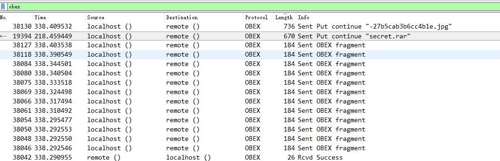

# 手机热点

> ## 手机热点
>
> ### 100
>
> 
>
> httppan.baidu.coms1cwwdVC 有一天皓宝宝没了流量只好手机来共享，顺便又从手机发了点小秘密到电脑，你能找到它吗？
> 题目来源：第七季极客大挑战
>
> [Blatand_1.pcapng](Blatand_1.pcapng)

## 1.wireshark

根据题目提示，手机共享，那么应该是蓝牙传输，而我们知道蓝牙传输协议为obex，过滤数据包看到如下图所示内容

发现传了一个图片和一个压缩包

导出分组字节流

可以得到压缩包

得到

`SYC{this_is_bluetooth}`