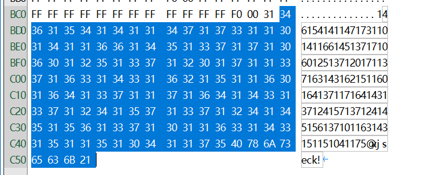

# 普通的二维码


> ## 普通的二维码
>
> ### 100
>
> 
>
> 来源：XJNU [misc80.zip](题目/misc80.zip)


## 16进制编辑器进行查看（推荐winhex）

直接扫二维码   `哈哈!就不告诉你flag就在这里!`

先是使用`Stegsolve图片三色素`进行测试

没有效果，仔细研究这句话

使用16进制编辑器打开这个二维码

发现这串数据格格不入 （其他的都是 FF F0 00）



然后发现这些数字大多是1开头的三位数

## 2.ascii码解密

想到ASCII码，查表发现146作为八进制时对应的是f ，然后把这串数字变成对应字符，得到flag

```python
a='146154141147173110141166145137171060125137120171137163143162151160164137117164143137124157137124145156137101163143151151041175'
flag=''
for i in range(int(len(a)/3)):
    flag+=chr(int(a[i*3:i*3+3],8))
print(flag)
```

`'flag{Have_y0U_Py_script_Otc_To_Ten_Ascii!}'`

