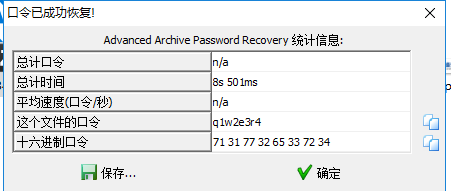

# 神秘的文件

> ## 神秘的文件
>
> ### 100
>
> 
>
> 来源：第七届山东省大学生网络安全技能大赛
>
> 
>
> 
>
> [5ee325f5-44c6-4a0b-b496-a0b11ef6dca1.rar](题目/5ee325f5-44c6-4a0b-b496-a0b11ef6dca1.rar)

## 1.明文攻击

下面先附上一个链接 [破解Zip加密文件常用的几种方法](https://www.cnblogs.com/ECJTUACM-873284962/p/9387711.html)

> 01.Zip属性隐藏
> 02.Zip伪加密
> 03.暴力破解
> 04.明文攻击
> 05.CRC32碰撞

解压得到一个加密的压缩包和一个图片

图片和压缩包的文件同名，所以使用明文攻击

> 对比一下**文件名称、文件大小、压缩后大小、修改日期、CRC值**等。

使用 **ARCHPR** 进行明文攻击

logo.png 》》生成一个新的zip压缩包

直接使用明文攻击报错

备份原来 要破解的压缩包，用压缩包格式打开直接把其中无关的文件删除（除logo.png之外）

然后继续

**坑点来了**

> 此题建立明文的压缩包只能是**WinRAR**，而我使用的是bandizip，最后用python实现压缩文件，还是不能达到明文攻击的效果

下面进行比对一下这三种方法的信息

## 2.docx隐写

最后解的口令是 `q1w2e3r4`

打开文档，什么信息也没有

因为是docx格式 是XML格式，可以进行解压缩，使用**everything**搜索发现flag文件

是`ZmxhZ3tkMGNYXzFzX3ppUF9maWxlfQ==`

很熟悉的格式 base64 得 `flag{d0cX_1s_ziP_file}`

