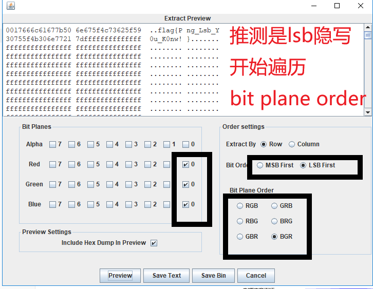

# 乌云邀请码

> ## 乌云邀请码
>
> ### 100
>
> 
>
> 来源：XJNU [misc50.zip](题目/misc50.zip)

## 1.Stegsolve图片三色素

解压得到png图片，使用**Stegsolve图片三色素**切换通道发现

发现其中的网址不在，推测可能藏有信息

点击Analyse——>Data Extract

所以得到flag `flag{Png_Lsb_Y0u_K0nw!}`