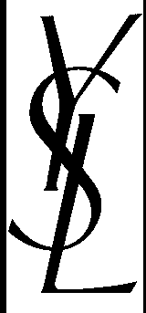

# 多彩


> ## 多彩
>
> ### 100
>
> 
>
> 


## 1.图片隐写工具 Stegsolve图片三色素

使用图片隐写工具 **Stegsolve图片三色素**进行查看

切换通道发现ysl，可以确定图片里面有隐藏信息



点击Analyse——>Data Extract


看到PK头。。心里有数。。直接save bin 存为zip格式

> 所有的zip文件，都是以PK这两个字母开头的。所以，无论怎么去修改zip文件的后缀，解压程序都可以简单的判断一个文件是不是有可能为zip文件。
>
> PK代表zip算法（PKZIP算法）的发明者菲尔·卡茨（Phil Katz）名字首字母的缩写。


**常用的文件开头**

> 1. MIDI (mid)，文件头：4D546864  
>2. JPEG (jpg)，文件头：FFD8FF   
> 3. PNG (png)，文件头：89504E47   
>4. GIF (gif)，文件头：47494638   
> 5. TIFF (tif)，文件头：49492A00   
>6. Windows Bitmap (bmp)，文件头：424D   
> 7. CAD (dwg)，文件头：41433130   
>8. Adobe Photoshop (psd)，文件头：38425053   
> 9. Rich Text Format (rtf)，文件头：7B5C727466   
>10. XML (xml)，文件头：3C3F786D6C   
> 11. HTML (html)，文件头：68746D6C3E   
>12. Email [thorough only] (eml)，文件头：44656C69766572792D646174653A   
> 13. Outlook Express (dbx)，文件头：CFAD12FEC5FD746F    
>14. Outlook (pst)，文件头：2142444E   
> 15. MS Word/Excel (xls.or.doc)，文件头：D0CF11E0   
>16. MS Access (mdb)，文件头：5374616E64617264204A   
> 17. WordPerfect (wpd)，文件头：FF575043   
>18. Postscript (eps.or.ps)，文件头：252150532D41646F6265   
> 19. Adobe Acrobat (pdf)，文件头：255044462D312E   
>20. Quicken (qdf)，文件头：AC9EBD8F   
> 21. Windows Password (pwl)，文件头：E3828596   
>22. ZIP Archive (zip)，文件头：504B0304   
> 23. RAR Archive (rar)，文件头：52617221   
>24. Wave (wav)，文件头：57415645   
> 25. AVI (avi)，文件头：52494646
>26. Real Audio (ram)，文件头：2E7261FD   
> 27. Real Media (rm)，文件头：2E524D46   
>28. Windows Media Audio（wma）（asf）,文件头：3026b2758e66cf
> 29. wrf, 文件头：574f5446000600
>30. MPEG (mpg)，文件头：000001BA   
> 31. MPEG (mpg)，文件头：000001B3   
>32. Quicktime (mov)，文件头：6D6F6F76   
> 32. Windows Media (asf)，文件头：3026B2758E66CF11   


## 2.binwalk分割文件

惯例 放binwalk 跑一下，有捆绑文件

提取一下文件 `binwalk flag.zip -e`

得到一个空的flag.txt 和一个加密的压缩包8.zip

**这里说明一下：在某个文章中看到说是只要的偶数就是为加密，例如00、02、04这样的，奇数就是有加密**

> 压缩源文件数据区： 
> 50 4B 03 04：这是头文件标记 
> 14 00：解压文件所需 pkware 版本 
> 00 00：全局方式位标记（有无加密） 
> 08 00：压缩方式 
> 07 76：最后修改文件时间 
> F2 48：最后修改文件日期 
> …… 
> 压缩源文件目录区： 
> 50 4B 01 02：目录中文件文件头标记(0x02014b50) 
> 1F 00：压缩使用的 pkware 版本 
> 14 00：解压文件所需 pkware 版本 
> 00 00：全局方式位标记（有无加密，这个更改这里进行伪加密，改为09 00打开就会提示有密码了） 
> 08 00：压缩方式 
> 07 76：最后修改文件时间 

经测试不是伪加密，只好老老实实破解密码

**搜索后发现是N1CTF国际赛的一道题目。。。秘密啊竟然是YSL对应口红色号的二进制转字符串。。。**


## 3.二进制转字符串

进入YSL的网站：`https://www.yslbeautyus.com/on/demandware.store/Sites-ysl-us-Site/en_US/Product-Variation?pid=194YSL`

最后得到色号：`1,27 ,59 ,11 ,23 ,7 ,57,1 ,1 ,76 ,222 ,1,1,50 ,214 ,6 ,77 ,50,53,214 ,6`

```python
"""
网上的libnum库安装成功了，但不能使用，这就很尴尬了。。。
只能去看源代码，把需要的方法提出来直接使用
但是打印的结果不大理想，推测可能是编码问题。。
"""
def b2s(b):
    """
    Binary to string.
    """
    ret = []
    b = b.zfill(int((len(b) + 7) / 8 * 8))
    for pos in range(0, len(b), 8):
        ret.append(chr(int(b[pos:pos + 8], 2)))
    return "".join(ret)

color = [1,27 ,59 ,11 ,23 ,7 ,57,1 ,1 ,76 ,222 ,1,1,50 ,214 ,6 ,77 ,50,53,214 ,6]
flag = ''
for i in color:
    flag +=str(bin(i)[2:])
print(b2s(flag))
```

因打印乱码，，，此题放弃掉。。。