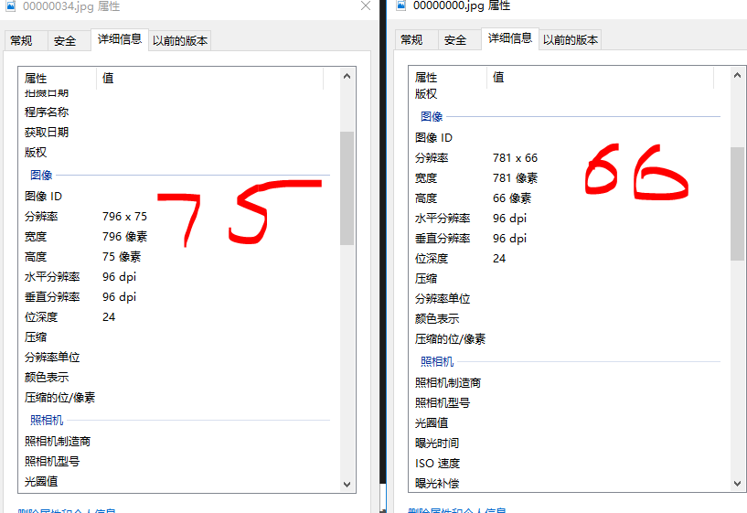
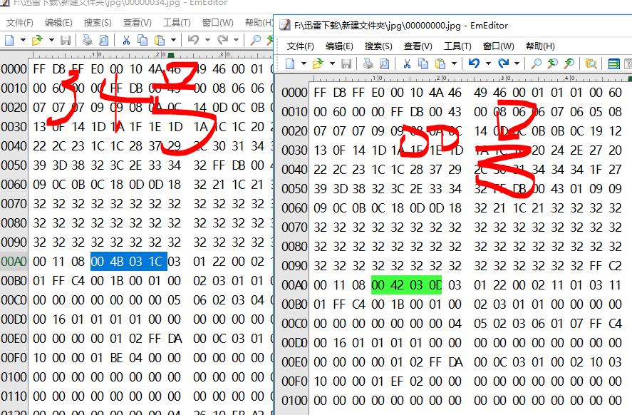

# 论剑

> ## 论剑
>
> ### 100
>
> 
>
> 剑客
>
> 十年磨一剑，霜刃未曾试。
> 今日把示君，谁有不平事。
>
> 

## 1.binwalk分离文件

先是使用**Stegsolve** 无果

binwalk 发现有两张图片，自带命令不能分离文件

这里使用foremost `foremost lunjian.jpg `

得到 `00000000.jpg` `00000034.jpg`

使用**Photoshop**打开第一张图片报错，推测第一张图片有问题

两张图片详细信息对比

分辨率有问题

##  **2.winhex** 分析

参考 [jpg 格式举例详解](https://blog.csdn.net/STN_LCD/article/details/78629029#)

设置宽高一样，右下角右端倪

于是不断调宽高，将42设置为92后得到

## 3.回过头来观察 原始文件

继续分析半天后，原始文件 看到一串01字符串且前面刚好有个f

`01101101 01111001 01101110 01100001 01101101 01100101 01101001 01110011 01101011 01100101 01111001 00100001 00100001 00100001 01101000 01101000 01101000`

转成ASCII为`mynameiskey!!!hhh`

emmm，放弃无思路

